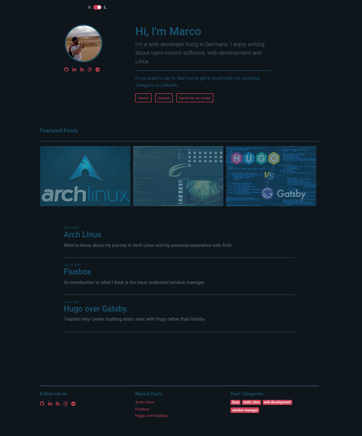
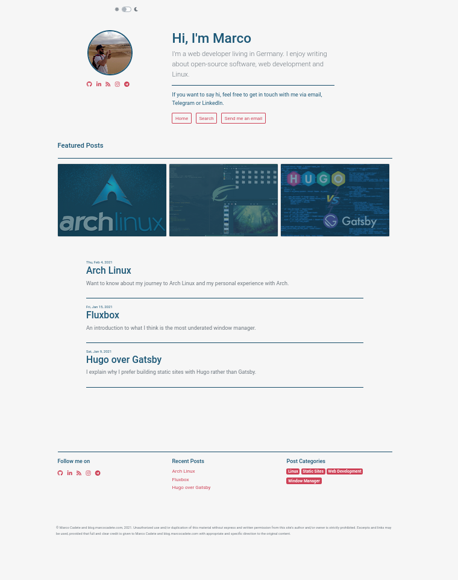

# My Blog
I built this website to express my interests in subjects such as web development, open-source software, and Linux.  

### Tools I used:
- [Hugo](https://gohugo.io/)
- [Bootstrap](https://getbootstrap.com/)
- [Gulp](https://gulpjs.com/)
- [Vue.js](https://vuejs.org/)
- JavaScript, HTML, SCSS  

### Color Palette: 

  

## Front Page Dark
  

## Front Page Light

